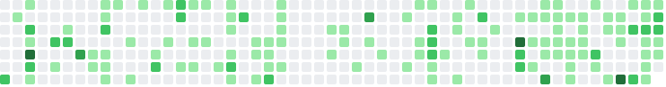

<div align="center">

# 

### im aarush *(rusetiq)*

i mostly do full stack stuff but somehow end up spending most of my time on **backend systems, ai/ml and random projects i decided were a good idea at 2am**

rn im working on **[vithi](https://vithistudy.web.app/)**

<sub>i code, doomscroll and occasionally remember i have school</sub>

<br />

<a href="https://github.com/rusetiq">
  
</a>
<a href="https://instagram.com/rusetiq">
  
</a>
<a href="https://x.com/rusetiq">
  
</a>
<a href="https://linkedin.com/in/rusetiq">
  
</a>

</div>

---

##  stuff i actually know

###  yeah im pretty good at these


* Python
* Node.js
* Flask
* Django
* Cloudflare Workers
* Firebase
* REST APIs
* backend architecture
* databases & caching

###  i can probably figure these out


* AI / ML research
* React
* Tailwind CSS
* C++
* model evaluation
* time-series forecasting
* security research

---

##  stuff ive made

### [vithi](https://vithistudy.web.app/)

made this cuz apparently keeping track of school normally wasnt complicated enough

basically a study management thing for keeping track of work, schedules and everything else i would otherwise forget

`React` `Firebase` `Neon Postgres` `Valkey` `Google Calendar`

---

### eVisa Bharat

i looked at india's eVisa website and decided yeah i wanna redo this

redesigned the whole experience to make applying less confusing, faster and actually usable on basically anything

`Cloudflare Workers` `full-stack web` `mock backend` `responsive UI`

---

### [Clippy Vision](https://github.com/protocorn/clippy-vision)

open source computer vision project ive contributed to

very cool project go look at it

`Python` `computer vision` `open source`

---

### dishkv2

we needed something to run hackathons

so i made something to run hackathons

built for Dunes, handles participants, events, authentication, admin stuff and basically everything else needed to actually run one

`full-stack` `authentication` `databases` `admin tooling`

---

## stuff i find cool

```text
backend engineering
distributed systems
ai/ml
developer tools
security
computer vision
making something for 7 hours straight then realizing its 3am
```

---

<div align="center">

### proof i occasionally code

<picture>
  <source media="(prefers-color-scheme: dark)" srcset="./assets/contributions.dark.svg" />
  <source media="(prefers-color-scheme: light)" srcset="./assets/contributions.light.svg" />
  
</picture>

<br /><br />

<sub>probably writing python instead of doing whatever im actually supposed to be doing rn</sub>

</div>
